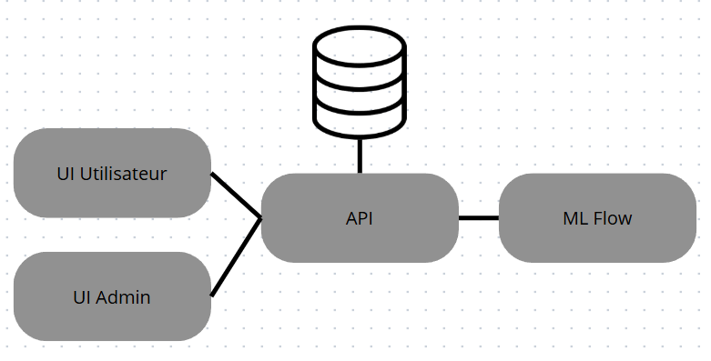

# Rendu TD

## Partie I : 

### Contexte Général

1. **Gérer la communication entre des microservices (API) avec Docker Compose, via des Domain Unix Sockets**  
   Cette fonctionnalité est déjà présente dans les fichiers initiaux, mais une exploration plus détaillée est effectuée dans la Partie 2.

2. **Ajouter une base de données dans l'écosystème**  
   J'ai ajouté une base de données PostgreSQL à l'écosystème en modifiant le fichier `main.py` de Service B pour y inclure une fonction `create_table_if_not_exists()`. Cette fonction crée une table `my_table` si elle n'existe pas, puis insère des données fictives si la table est vide. J'ai utilisé `asyncpg` pour la connexion à la base de données et `FastAPI` pour gérer les événements de démarrage et d'arrêt. Le tout est orchestré avec Docker Compose, où les services (Service A, Service B et PostgreSQL) sont lancés dans des conteneurs Docker.

3. **Introduire les GitHub Actions (.github/workflows/ci_cd.yml)**  
   J'ai mis en place un workflow d'intégration continue (CI) et de livraison continue (CD) avec GitHub Actions. J'ai créé un fichier `.github/workflows/ci_cd.yml` qui déclenche automatiquement des tests unitaires à chaque push ou pull request vers la branche `main`. Si les tests réussissent, l'image Docker de l'application est construite, poussée sur DockerHub, puis déployée sur un serveur de production via Docker Compose. J'ai également indiqué la nécessité de configurer les secrets DockerHub dans GitHub pour l'authentification, afin de permettre l'accès au dépôt Docker et au déploiement automatisé.

4. **L'utilisation de Nginx est-elle nécessaire ?**  
   L'utilisation de Nginx n'est pas absolument nécessaire dans ce projet. Si l'objectif est de faire communiquer deux services FastAPI via des Unix Domain Sockets (UDS), Nginx n'est pas requis. Cependant, il pourrait être utile dans certains cas :  
   - **Reverse Proxy** : Nginx pourrait servir de reverse proxy pour exposer les services FastAPI au monde extérieur, en dirigeant les requêtes vers les bons services via les UDS ou des ports internes.  
   - **Sécurisation** : Nginx pourrait ajouter des fonctionnalités comme la gestion de certificats SSL, mais ce n’est pas obligatoire en environnement local.  
   - **Scalabilité et gestion du trafic** : Si plusieurs instances de services sont déployées, Nginx pourrait aider à équilibrer le trafic.  
   En résumé, dans un environnement de développement ou pour un projet simple, Nginx n'est pas nécessaire.

5. **Migrer de Docker Compose vers Kubernetes (Minikube) ?**  
   Migrer de Docker Compose vers Kubernetes (Minikube) peut être une bonne idée si l'on cherche à faire évoluer le projet. Kubernetes offre plusieurs avantages :  
   - **Scalabilité** : Kubernetes permet de gérer plusieurs instances de services plus facilement.  
   - **Gestion avancée des ressources** : Il optimise l’utilisation des ressources comme la CPU et la mémoire, ce qui est utile pour un projet en production.  
   - **Haute disponibilité** : Kubernetes permet de déployer plusieurs répliques de services pour garantir leur disponibilité en cas de panne.  
   - **Gestion des configurations et secrets** : Kubernetes propose une gestion intégrée des configurations et des secrets.  
   Cependant, Kubernetes peut ajouter de la complexité au projet. Minikube, par exemple, peut être plus lourd à gérer localement que Docker Compose, et Kubernetes peut nécessiter davantage de ressources matérielles.  
   Si le projet reste simple, Docker Compose pourrait suffire. Mais si une infrastructure plus robuste à grande échelle est nécessaire, migrer vers Kubernetes serait un meilleur choix.

## Partie II – Un portail web adapté

J’ai mis en place une architecture basée sur quatre conteneurs Docker : un pour l’API qui gère les deux interfaces utilisateurs, un pour la base de données PostgreSQL, un pour l’interface utilisateur classique, et un dernier pour l’interface admin. L’API gère toutes les interactions avec la base de données, permettant d’ajouter, récupérer et supprimer des utilisateurs. Plutôt que de séparer en deux APIs, j’ai regroupé tout dans une seule API avec des routes dédiées aux utilisateurs et aux administrateurs.

Les deux interfaces Gradio communiquent avec l’API via un socket Unix, ce qui évite d’exposer des ports réseau inutiles et améliore la sécurité. L’interface utilisateur permet d’envoyer un nom et de le rajouter à la base de données, tandis que l’interface admin peut récupérer la liste des utilisateurs et en supprimer. Chaque interface tourne dans son propre conteneur, ce qui isole les services et facilite le déploiement.

Grâce à Docker, l’ensemble est facilement déployable et réplicable. Le conteneur PostgreSQL stocke les données, l’API interagit avec lui, et les interfaces Gradio fournissent un accès utilisateur et admin. Cette approche assure une bonne séparation des responsabilités et une architecture modulaire et sécurisée.

---

## Partie III – Un portail web pour tous les gouvernés (conception et architecture de système pour du ML)

Dans cette partie, nous concevons un portail web pour le traitement automatisé des documents juridiques en utilisant des outils de NLP, intégrés dans une architecture modulaire avec FastAPI, Gradio, PostgreSQL et MLflow. L'objectif est d'offrir des interfaces interactives pour les utilisateurs et les administrateurs tout en garantissant un suivi et une gestion efficace des annotations et des modèles de TAL.

1. **API FastAPI pour du NLP**  
   L'élément central de cette plateforme serait une API FastAPI, qui hébergerait des outils de NLP pour annoter des documents juridiques. L'API exposerait plusieurs endpoints :  
   - `/api/annotate` : Permettrait d'envoyer un document brut (texte ou PDF) pour annotation.  
   - `/api/annotate/entities` : Retournerait les entités extraites du texte (par exemple, des noms de parties prenantes, des dates, des références légales).  
   - `/api/annotate/relations` : Analyserait les relations entre les entités détectées dans le texte (par exemple, la relation entre un avocat et un client).  
   L'API utiliserait des bibliothèques comme `spaCy` et `transformers` (Hugging Face) pour réaliser des tâches comme la reconnaissance d'entités nommées (NER), la tokenisation, la lemmatisation et l’analyse des relations. En parallèle, **MLflow** serait utilisé pour suivre les expérimentations des modèles. Chaque modèle de traitement linguistique utilisé serait enregistré dans MLflow, permettant ainsi de suivre les performances des modèles, d’évaluer différentes versions et de gérer leur mise à jour au fil du temps.

2. **Interfaces Utilisateurs avec Gradio**  
   Deux interfaces seraient créées pour interagir avec l'API, et elles seraient déployées dans des conteneurs distincts pour plus de flexibilité :  
   - **Interface Utilisateur classique (UI)** :  
     - Permet à l'utilisateur (un avocat, par exemple) de soumettre un texte brut (ou un PDF) via un formulaire et de visualiser les annotations en temps réel, comme les entités extraites, les dates et les relations détectées.  
     - L'utilisateur pourrait interagir avec les annotations, corriger les erreurs et ajouter des notes supplémentaires.  
     - Cette interface utiliserait Gradio pour une expérience utilisateur simple et interactive.  
   - **Interface Administrateur** :  
     - Permet à l'administrateur ou au responsable de la plateforme de superviser les annotations, gérer les versions des modèles et effectuer des mises à jour manuelles des annotations.  
     - L'interface permettrait de visualiser les métriques des modèles (précision, rappel, etc.) et de suivre les performances des expérimentations via MLflow.  
     - Elle permettrait aussi de gérer les modèles et de superviser les tâches d’annotation plus complexes.

3. **Base de Données PostgreSQL pour Stocker les Annotations**  
   Les annotations générées seraient stockées dans une base de données PostgreSQL, hébergée dans un conteneur Docker séparé. Les données stockées dans cette base seraient les suivantes :  
   - **Annotations** : Entités, relations, dates et autres éléments extraits.  
   - **Historique des annotations** : Chaque modification manuelle effectuée par un utilisateur serait enregistrée pour permettre une traçabilité et faciliter les corrections futures.  
   - **Modèles de version** : Les versions des modèles utilisés seraient également stockées pour que les résultats puissent être réutilisés avec les modèles les plus récents.  
   Cette base de données permettrait une gestion centralisée des annotations et faciliterait l'analyse des documents juridiques, tout en assurant que les données soient facilement accessibles pour d'autres outils ou applications.

4. **Suivi des Modèles avec MLflow**  
   MLflow jouerait un rôle clé dans la gestion et le suivi des modèles de TAL utilisés dans cette plateforme. Pour chaque nouvelle version de modèle déployée, par exemple un modèle amélioré de NER pour mieux identifier les lois pertinentes dans les documents, MLflow permettrait de suivre :  
   - Les hyperparamètres utilisés pour entraîner chaque modèle.  
   - Les performances du modèle sur les annotations manuelles et automatiques (précision, rappel, F1-score, etc.).  
   - Les versions du modèle et les comparaisons entre différents modèles.  
   - Les expérimentations réalisées, y compris les jeux de données utilisés et les résultats.  
   L'intégration de MLflow dans le processus permettrait d'améliorer la qualité des annotations et de rendre les modèles plus robustes à mesure que de nouvelles données sont traitées et annotées.

